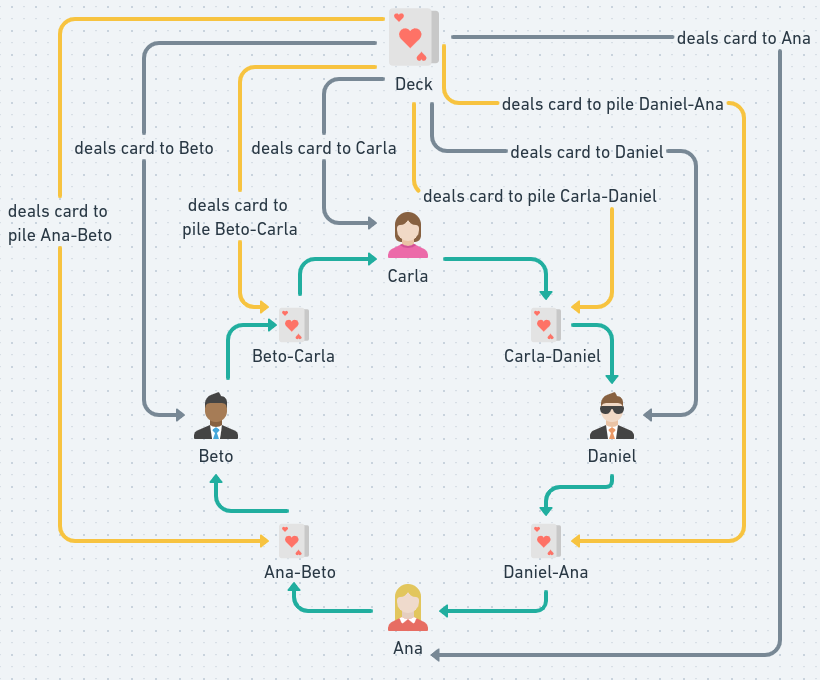

# Game Cards

    

     
    

## Problem Description
- Consider a deck of 24 cards, divided into 6 different types, with 4 cards of each suit. For standardization, we use cards numbered 1 to 6 and the suits O, C, E, and P.

- The cards that will be used are: 1O, 1C, 1E, 1P, 2O, 2C, 2E, 2P, 3O, 3C, 3E, 3P, 4O, 4C, 4E, 4P, 5O, 5C, 5E, 5P, 6O, 6C, 6E, and 6P.

- Four players (processes/threads) will play, and each player can hold 4 cards at a time. Between each pair of adjacent players (i.e., sitting next to each other), there is a stack of 2 cards.

- The players' names are: Ana, Beto, Carla, and Daniel.

- The game starts with dealing four random cards to each player and placing two cards in each stack between adjacent players. The stacks work in a FIFO (First In, First Out) manner, and players cannot choose the card they will pick.

- Two types of games must be implemented: five-hand and four-hand.

## General Rules
- There are no turns; all players play simultaneously. As long as there is space to discard a card in the left stack and there is a card available in the right stack, players can continue playing.

- Players have the freedom to choose which card to discard from the four cards in their hand. Players cannot choose the card from the stack.

- Players are not allowed to cheat. When a player claims victory, all other players must stop. There are no ties; the first player to claim victory will be the champion.

## Game 2: Hand of 4 Cards
- In this game, each player can hold only four cards in their hand simultaneously.
- Each player behaves according to the following algorithm.

- The intermediate stacks have a size of 3, meaning they can hold up to three cards. Similar to the hand of five, the hand of four also checks if there is a winner. If there is, they are set as the winner; otherwise, the game continues, but now each player first discards one card and then draws another card.

- As I had already shown the deck distribution in the hand of five, here I decided to show only the correct execution of the hand of four, where players first discard a card from one stack and then draw another card from another stack. Then, the hand of each player is displayed.

## Game 1: Hand of 5
- In this game, each player can hold five cards in their hand simultaneously. Each player behaves according to the following algorithm.

- The intermediate stacks have a size of 2, meaning they can hold up to two cards. In the game function, it is also checked if there is a winner; if someone wins, they are set as the winner. As long as there is no winner, the game continues, with each player first drawing a card and then discarding another card.